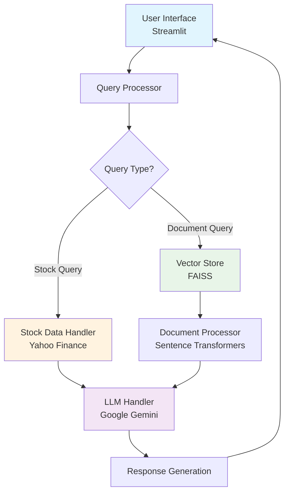

# 💰 Finance RAG System.
**A comprehensive Finance-Focused Retrieval-Augmented Generation (RAG) System built with Python and Streamlit**

[Features](#-features) •
[Quick Start](#-quick-start) •
[Documentation](#-documentation) •
[Demo](#-demo) •
[Contributing](#-contributing)

</div>

---

## 🌟 Overview

The **Finance RAG System** is an intelligent financial analysis platform that combines document processing, real-time stock data, and AI-powered insights to provide comprehensive financial analysis. Built with modern technologies like FAISS for vector search, Google Gemini for intelligent responses, and Streamlit for an intuitive user interface.

### 🎯 What it Does

- **📄 Document Intelligence**: Processes PDF and TXT financial documents using semantic embeddings
- **📈 Real-time Stock Data**: Integrates with Yahoo Finance for live market data and interactive charts
- **🤖 AI-Powered Analysis**: Uses Google Gemini to generate intelligent financial insights
- **💬 Conversational Interface**: Chat-based interaction for natural financial queries
- **🔍 Smart Search**: FAISS-powered vector search for relevant document retrieval

---

## 🚀 Features

### Core Capabilities
- ✅ **Multi-format Document Processing** (PDF, TXT)
- ✅ **Real-time Stock Data Integration** (Yahoo Finance API)
- ✅ **Semantic Search** with FAISS vector database
- ✅ **Interactive Stock Charts** with Plotly visualizations
- ✅ **AI-Powered Response Generation** with Google Gemini
- ✅ **Smart Query Detection** (stock vs document queries)
- ✅ **Conversational Chat Interface** with Streamlit

### Technical Features
- ✅ **Fast Response Times** (< 2 seconds)
- ✅ **Docker Containerization** for easy deployment
- ✅ **Modular Architecture** with clean separation of concerns
- ✅ **Error Handling & Fallbacks** for robust operation
- ✅ **Caching System** for improved performance
- ✅ **Health Monitoring** and logging
- ✅ **Production-Ready** configuration

---

## 🏗️ Architecture



### Component Overview

| Component | Technology | Purpose |
|-----------|------------|---------|
| **Frontend** | Streamlit | Interactive web interface |
| **Document Processing** | Sentence Transformers | Text embedding generation |
| **Vector Search** | FAISS | Similarity search and retrieval |
| **Stock Data** | yfinance | Real-time financial data |
| **AI Engine** | Google Gemini | Intelligent response generation |
| **Visualization** | Plotly | Interactive stock charts |

---

## 📁 Project Structure

```
finance-rag-system/
├── 📱 app.py                          # Main Streamlit application
├── 📋 requirements.txt                # Python dependencies
├── 🐳 Dockerfile                      # Docker configuration
├── 🐳 docker-compose.yml             # Multi-container setup
├── ⚙️ .env.example                   # Environment variables template
│
├── 📂 src/                           # Core application modules
│   ├── 📄 document_processor.py      # Document ingestion & processing
│   ├── 🔍 vector_store.py           # FAISS vector database
│   ├── 🔄 query_processor.py        # Query processing & retrieval
│   ├── 📈 stock_data.py             # Stock data & visualization
│   ├── 🤖 llm_handler.py            # Google Gemini API integration
│   └── ⚙️ utils.py                  # Utility functions
│
├── 📂 documents/                     # Financial documents
│   ├── 📄 sample_apple_earnings.txt
│   ├── 📊 sample_market_analysis.txt
│   └── 📋 sample_financial_report.txt
│
├── 📂 data/                         # Application data
├── 📂 scripts/                      # Setup & utility scripts
└── 📖 README.md                     # This file
```

---

## ⚡ Quick Start

### Prerequisites

- **Python 3.9+**
- **Docker** (optional, for containerized deployment)
- **Google Gemini** (for AI-powered responses)

### 🐍 Local Development Setup

1. **Clone and Setup**
   ```bash
   git clone <repository-url>
   cd finance-rag-system
   
   # Create virtual environment
   python3 -m venv venv
   source venv/bin/activate  # On Windows: venv\Scripts\activate
   ```

2. **Install Dependencies**
   ```bash
   pip install -r requirements.txt
   ```

3. **Configure Environment**
   ```bash
   # Copy environment template
   cp .env.example .env
   
   # Edit .env and add your GOOGLE_API_KEY
   GOOGLE_API_KEY=your_actual_api_key_here
   ```

4. **Run the Application**
   ```bash
   streamlit run app.py
   ```

5. **Access the Application**
   ```
   🌐 Open: http://localhost:8501
   ```

### 🐳 Docker Deployment

1. **Quick Start with Docker Compose**
   ```bash
   # Setup environment
   cp .env.example .env
   # Edit .env with your API key
   
   # Build and run
   docker-compose up --build
   
   # Access at: http://localhost:8501
   ```

2. **Production Deployment**
   ```bash
   # Use production configuration
   docker-compose -f docker-compose.prod.yml up -d
   ```

---

## 💡 Usage Examples

### 📈 Stock Analysis Queries
```
✨ "What is Apple's stock performance this week?"
✨ "Show me Microsoft stock trends for the last month"
✨ "Compare AAPL vs MSFT performance"
✨ "Display Tesla stock chart with volume data"
```

### 📊 Financial Document Queries
```
✨ "Summarize the latest earnings report"
✨ "What are the key financial metrics mentioned?"
✨ "Find information about revenue growth"
✨ "Analyze the market trends in Q3"
```

### 🔄 Mixed Queries
```
✨ "How is Apple performing based on recent earnings?"
✨ "What do the documents say about Microsoft's growth?"
✨ "Compare stock performance with earnings results"
```

---

## 🔧 Configuration

### Environment Variables

Create a `.env` file from the template:

```bash
# Core Configuration
GOOGLE_API_KEY=your_google_api_key_here
GOOGLE_MODEL=gemini-1.5-flash

# Application Settings
MAX_DOCUMENTS=100 
EMBEDDING_MODEL=all-MiniLM-L6-v2
DEFAULT_STOCK_PERIOD=1mo

# Performance Settings
ENABLE_CACHING=true
CACHE_TIMEOUT=300
REQUEST_TIMEOUT=30
```

### Adding Your Own Documents

1. **Place documents in the `documents/` folder**
   ```bash
   documents/
   ├── your_financial_report.pdf
   ├── earnings_transcript.txt
   └── market_analysis.pdf
   ```

2. **Supported formats:**
   - **PDF files** (automatic text extraction)
   - **TXT files** (plain text)

3. **Restart the application** - documents are processed automatically

---

## 📊 Features in Detail

### 🔍 Document Processing
- **Multi-format Support**: PDF and TXT files
- **Semantic Embeddings**: Uses Sentence Transformers for high-quality embeddings
- **Automatic Chunking**: Intelligent text segmentation for optimal retrieval
- **In-memory Storage**: Fast access with dictionary-based document store

### 🗃️ Vector Search
- **FAISS Integration**: High-performance similarity search
- **Configurable Similarity**: Adjustable similarity thresholds
- **Real-time Indexing**: Dynamic document addition and removal

### 📈 Stock Data Integration
- **Yahoo Finance API**: No API key required for stock data
- **Multiple Timeframes**: Support for various periods (1d, 1w, 1m, 1y)
- **Interactive Charts**: Candlestick and line charts with Plotly
- **Technical Indicators**: Basic trend analysis and metrics

### 🤖 AI-Powered Responses
- **Context-Aware**: Combines document content with stock data
- **Fallback Mode**: Works without Google Gemini API (limited functionality)
- **Smart Prompting**: Optimized prompts for financial analysis

---

## 🧪 Testing & Development

### Run Tests
```bash
# Basic functionality tests
bash scripts/test.sh

# Development mode with auto-reload
bash scripts/run-dev.sh
```

### Sample Test Queries
```bash
# Test the application with these queries:
"What is Apple's stock trend this month?"
"Summarize earnings reports"
"Compare AAPL vs MSFT"
"Show me technology market analysis"
```

---

## 🐳 Docker Reference

### Development
```bash
# Build and run development environment
docker-compose up --build

# View logs
docker-compose logs -f

# Stop containers
docker-compose down
```

### Production
```bash
# Production deployment
docker-compose -f docker-compose.prod.yml up -d

# Health check
curl http://localhost:8501/_stcore/health

# Monitor logs
docker-compose -f docker-compose.prod.yml logs -f
```

---

## 🔒 Security & Best Practices

### Environment Security
- ✅ Store API keys in environment variables
- ✅ Never commit `.env` files to version control
- ✅ Use Docker secrets for production deployments
- ✅ Implement rate limiting for API calls

### Production Deployment
- ✅ Use reverse proxy (Nginx) for production
- ✅ Enable HTTPS with SSL certificates
- ✅ Set up monitoring and logging
- ✅ Configure backup strategies

---

## 🛠️ Troubleshooting

### Common Issues

**1. Google API Key Issues**
```bash
# Check API key configuration
grep GOOGLE_API_KEY .env

# Verify API key is valid
curl -H "Authorization: Bearer YOUR_API_KEY" \
     https://api.googleapis.com/v1/models
```

**2. Document Processing Errors**
- Ensure documents are in supported formats (PDF, TXT)
- Check file permissions and encoding
- Verify `documents/` folder exists

**3. Stock Data Issues**
- Check internet connection
- Verify stock symbols are valid
- Some symbols may not be available on Yahoo Finance

**4. Performance Issues**
```bash
# Enable caching in .env
ENABLE_CACHING=true

# Reduce document count
MAX_DOCUMENTS=50

# Use lighter embedding model
EMBEDDING_MODEL=all-MiniLM-L6-v2
```

### Getting Help

1. **Check logs**: Look in the `logs/` directory or console output
2. **Run tests**: Use `bash scripts/test.sh` to verify setup
3. **Health check**: Visit `http://localhost:8501/_stcore/health`

---

## 📈 Performance Optimization

### For Large Document Collections
```bash
# Optimize document processing
MAX_DOCUMENTS=200
DOCUMENT_CHUNK_SIZE=1000

# Use more powerful embedding model
EMBEDDING_MODEL=all-mpnet-base-v2

# Enable persistent caching
ENABLE_CACHING=true
CACHE_TIMEOUT=600
---

## 🔄 API Reference

### Core Endpoints
- **Main Interface**: `http://localhost:8501`
- **Health Check**: `http://localhost:8501/_stcore/health`
- **Static Files**: `http://localhost:8501/static/`

### Environment Variables Reference
| Variable | Default | Description |
|----------|---------|-------------|
| `GOOGLE_API_KEY` | `required` | Google API key |
| `GOOGLE_MODEL` | `gemini-1.5-flash` | Google model to use |
| `MAX_DOCUMENTS` | `100` | Maximum documents to process |
| `EMBEDDING_MODEL` | `all-MiniLM-L6-v2` | Sentence transformer model |
| `DEFAULT_STOCK_PERIOD` | `1mo` | Default stock data period |
| `ENABLE_CACHING` | `true` | Enable response caching |

---

## 🤝 Contributing

We welcome contributions! Here's how to get started:

1. **Fork the repository**
2. **Create a feature branch**
   ```bash
   git checkout -b feature/amazing-feature
   ```
3. **Make your changes**
4. **Run tests**
   ```bash
   bash scripts/test.sh
   ```
5. **Commit your changes**
   ```bash
   git commit -m "Add amazing feature"
   ```
6. **Push to the branch**
   ```bash
   git push origin feature/amazing-feature
   ```
7. **Open a Pull Request**

### Development Guidelines
- Follow PEP 8 style guidelines
- Add tests for new features
- Update documentation as needed
- Ensure Docker builds work

---

## 📝 Changelog

### Version 1.0.0 (Current)
- ✅ Initial release
- ✅ Document processing with PDF/TXT support
- ✅ Real-time stock data integration
- ✅ Google Gemini integration
- ✅ Interactive Streamlit interface
- ✅ Docker containerization
- ✅ Vector search with FAISS

### Planned Features
- 🔄 Support for Excel files
- 🔄 Advanced technical analysis
- 🔄 Multiple language support
- 🔄 Persistent vector storage
- 🔄 API endpoints
- 🔄 User authentication

</div>